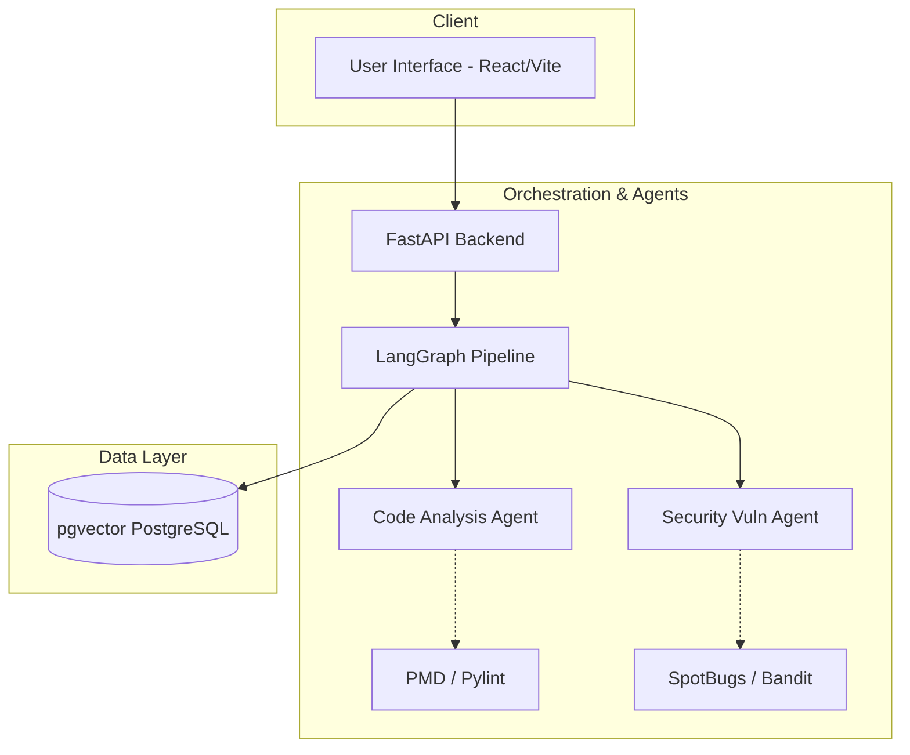

# AI Code Review & Security Analysis Agent

A robust, AI-powered tool for deep code analysis, real-time feedback, and security vulnerability detection. This project is designed to evaluate both Python and Java code, checking for syntax issues, structural flaws, and security risks (OWASP/CWE) using a Multi-Agent architecture and a Retrieval-Augmented Generation (RAG) knowledge base.

## 🚀 Features (Milestone 2 Complete)

*   **Multi-Agent Orchestration (LangGraph)**: Automatically routes code through a parallel pipeline running a Code Analysis Agent and a Security Vulnerability Agent simultaneously.
*   **Code Analysis Agent**: Uses `Pylint` (Python) and `PMD` (Java) mapped to a rigid severity rubric to detect code smells, long methods, unused imports, and design anti-patterns.
*   **Security Vulnerability Agent**: Uses `Bandit` (Python) and `SpotBugs/FindSecBugs` (Java) to flag OWASP top 10 vulnerabilities (Code Injection, SQL Injection, Hardcoded Secrets) matched directly to CWE IDs.
*   **RAG Knowledge Base**: Powered by `all-MiniLM-L6-v2` and `pgvector`, enhanced with a **Cross-Encoder re-ranker** (`ms-marco-MiniLM-L-6-v2`) to provide high-quality context on security flaws.
*   **Real-time Feedback UI**: A sleek, reactive frontend built with React, Vite, and Monaco Editor featuring interactive code scanning, history tracking, and detailed error cards.

## 🏗 Architecture

The system is broken down into three main modules:

1.  **Client Interface**: React/Vite frontend for seamless user interaction.
2.  **Multi-Agent Pipeline (FastAPI & LangGraph)**: Handles incoming code, performs static analysis, enriches findings via LLM (Anthropic), and merges outputs.
3.  **RAG Pipeline**:
    *   **Vector DB**: Uses PostgreSQL with the `pgvector` extension.
    *   **Embeddings**: Powered by HuggingFace's sentence-transformers.
    *   **Knowledge Base**: Contains markdown files detailing secure coding practices.

### Component Diagram



## 🛠 Tech Stack

**Frontend:**
*   React 19 + Vite + Monaco Editor
*   Vanilla CSS (Modern, dynamic styling)

**Backend:**
*   Python 3.11 + FastAPI + LangGraph
*   SQLAlchemy + PostgreSQL (pgvector)
*   Anthropic LLM APIs

## 🚦 Getting Started

### Prerequisites
*   Docker & Docker Compose
*   Node.js (v18+)
*   Anthropic API Key

### Running the Environment

1. **Configure Environment:** Create a `.env` file in the root directory and add your LLM API Key:
   ```env
   ANTHROPIC_API_KEY=your_real_key_here
   ```

2. **Start the Backend:** The project includes a `docker-compose.yml` that sets up the database and backend.
   ```bash
   docker-compose up -d --build
   ```
   *The backend will be available at `http://127.0.0.1:8000`.*

3. **Start the Frontend:** 
   *(Note: Ensure your root project folder does NOT contain the `&` symbol on Windows, otherwise `npm` commands may fail).*
   ```bash
   cd frontend
   npm install
   npm run dev
   ```
   *The frontend will be accessible at `http://localhost:5173`.*

## 📂 Project Structure

```
├── backend/                  # FastAPI backend & Agents
│   ├── agents/               # LangGraph agents (orchestrator, code_analysis, security_vuln)
│   ├── services/             # Validation logic, Java/Python CLI wrappers, RAG retrieval
│   └── main.py               # Application entry point
├── frontend/                 # React UI
│   └── src/                  # React components, styles, and logic
├── data/                     # Data stores
│   └── kb_sources/           # Knowledge base markdown files (OWASP, Secure Coding)
├── docs/                     # Architectural diagrams and schema documentation
└── docker-compose.yml        # Docker composition for DB and Backend
```

## 📜 Future Enhancements (Milestone 3)

*   **Dedicated Remediation Agent**: Auto-generate PR fixes for caught vulnerabilities.
*   **Conversational Code Assistance**: RAG-powered chat terminal inside the UI to query specific findings.
*   **PR Summary Agent**: Compiles findings into a structured, human-readable PR review summary.
