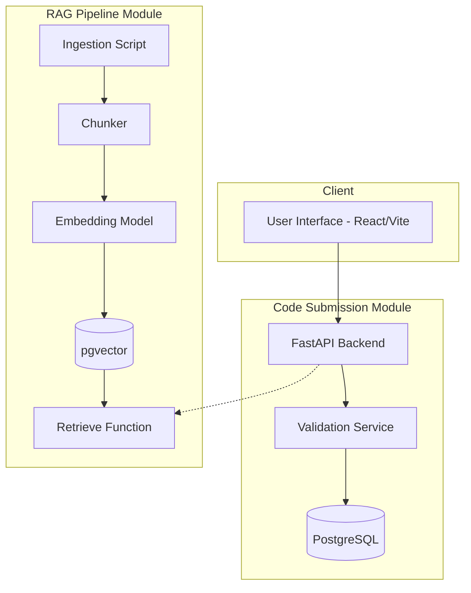

# AI Code Review & Security Analysis Agent

A robust, AI-powered tool for deep code analysis, real-time feedback, and security vulnerability detection. This project is designed to evaluate both Python and Java code, checking for syntax issues, structural flaws, and security risks (OWASP/CWE) using a Retrieval-Augmented Generation (RAG) knowledge base.

## 🚀 Features

*   **Multi-language Support**: Analyzes Python and Java code submissions.
*   **Dual Submission Methods**: Supports both direct code pasting and file uploads.
*   **Syntax & Structural Validation**: Uses AST (Python) and javalang (Java) with heuristic fallbacks to ensure code correctness before deeper analysis.
*   **Security Vulnerability Detection**: Leverages a semantic RAG pipeline powered by `all-MiniLM-L6-v2` and `pgvector` to identify and provide context on security flaws (OWASP Top 10, CWEs).
*   **Real-time Feedback UI**: A sleek, reactive frontend built with React, Vite, and Monaco Editor featuring interactive code scanning, history tracking, and detailed error cards.

## 🏗 Architecture

The system is broken down into three main modules:

1.  **Client Interface**: React/Vite frontend for seamless user interaction.
2.  **Code Submission & Validation (FastAPI)**: Handles incoming code, performs initial parsing, and persists results to PostgreSQL.
3.  **RAG Pipeline**:
    *   **Vector DB**: Uses PostgreSQL with the `pgvector` extension.
    *   **Embeddings**: Powered by HuggingFace's sentence-transformers (`all-MiniLM-L6-v2`).
    *   **Knowledge Base**: Contains markdown files detailing secure coding practices and common vulnerabilities.

### Component Diagram



## 🛠 Tech Stack

**Frontend:**
*   React 19 + Vite
*   Monaco Editor (Code viewing)
*   Vanilla CSS (Modern, dynamic styling)

**Backend:**
*   Python 3.11 + FastAPI
*   SQLAlchemy + PostgreSQL (pgvector)
*   Sentence Transformers (HuggingFace)

## 🚦 Getting Started

### Prerequisites
*   Docker & Docker Compose
*   Node.js (v18+)

### Running with Docker (Recommended for Backend/DB)

The project includes a `docker-compose.yml` that sets up the PostgreSQL database (with pgvector) and the FastAPI backend.

```bash
# Start the backend and database services
docker-compose up -d --build
```
*The backend will be available at `http://localhost:8000`.*

### Running the Frontend Locally

```bash
cd frontend
npm install
npm run dev
```
*The frontend will be accessible at `http://localhost:5173`.*

## 📂 Project Structure

```
├── backend/                  # FastAPI backend
│   ├── main.py               # Application entry point
│   ├── models.py             # SQLAlchemy models & schema definitions
│   ├── routers/              # API endpoints (submission, history)
│   ├── services/             # Validation logic and RAG retrieval
│   └── requirements.txt      # Python dependencies
├── frontend/                 # React UI
│   ├── src/                  # React components, styles, and logic
│   └── package.json          # Node dependencies
├── data/                     # Data stores
│   └── kb_sources/           # Knowledge base markdown files (OWASP, Secure Coding)
├── docs/                     # Architectural diagrams and schema documentation
└── docker-compose.yml        # Docker composition for DB and Backend
```

## 📜 Future Enhancements

*   **Dedicated Agents**: Introduction of specific agents for Remediation, PR Summaries, and Conversational Code Assistance.
*   **Extended Language Support**: Adding validation and analysis for languages like JavaScript/TypeScript, Go, and Rust.
*   **CI/CD Integration**: Enabling automated security scanning via GitHub Actions.
