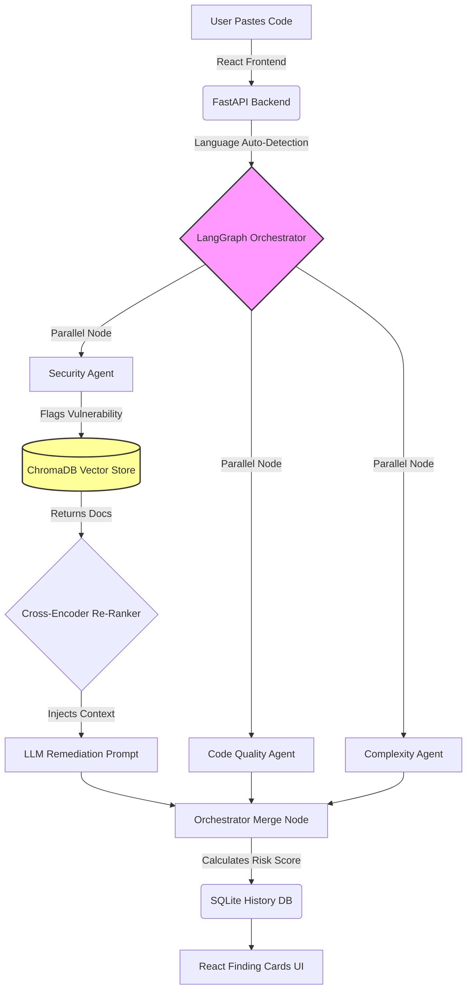

<div align="center">
  
# 🤖 AI Code Review & Security Analysis Agent

[](https://www.python.org/downloads/)
[](https://reactjs.org/)
[](https://fastapi.tiangolo.com/)
[](https://python.langchain.com/docs/langgraph)
[](https://www.trychroma.com/)

*An automated DevSecOps pipeline that acts as a senior security engineer, dynamically analyzing your code in real-time using parallel AI agents and an embedded vector knowledge base.*

</div>

---

## 📖 Table of Contents
- [Overview](#-overview)
- [System Architecture](#-system-architecture)
- [Core Features](#-core-features)
- [Tech Stack](#-tech-stack)
- [Getting Started](#-getting-started)
- [Knowledge Base Tester](#-knowledge-base-tester)

---

## 🚀 Overview
Traditional static analysis tools (like Semgrep or SonarQube) often produce noisy false positives and struggle with uncompiled code snippets. This agent solves that by orchestrating **multiple specialized AI agents in parallel** via LangGraph. 

When a vulnerability is detected, the agent queries a **ChromaDB Vector Database** loaded with official OWASP and CERT documentation. It mathematically re-ranks the guidelines using a **Cross-Encoder** and feeds the precise security context to the LLM, ensuring the suggested code fix is 100% accurate, hallucination-free, and enterprise-ready.

---

## 🧠 System Architecture



---

## ✨ Core Features

*   **⚡ Parallel Multi-Agent Analysis:** Security, Code Quality, and Complexity metrics are evaluated simultaneously to drastically reduce analysis time.
*   **🛡️ RAG Security Pipeline:** Vulnerabilities are checked against embedded OWASP Top 10 guidelines using a mathematically precise Retrieval-Augmented Generation (RAG) pipeline.
*   **🧩 Automated Remediation:** Doesn't just tell you *what* is wrong; provides the exact rewritten, drop-in replacement code to fix the issue.
*   **📊 Dynamic Risk Scoring:** Automatically grades severity levels (Critical, High, Medium, Low) and estimates the hours required to patch the application.
*   **📚 Interactive KB Tester:** A dedicated UI tab allowing developers to manually query the internal ChromaDB to verify the security knowledge base.
*   **💬 Conversational AI Assistant:** A floating chat UI that knows your scan history, allowing you to ask follow-up questions about the identified vulnerabilities.

---

## 🛠️ Tech Stack

| Domain | Technology |
| :--- | :--- |
| **Frontend** | React.js, Vite, Monaco Editor, Vanilla CSS Grid/Flexbox |
| **Backend API** | FastAPI, Uvicorn, Pydantic |
| **Agent Orchestration** | LangGraph, LangChain, Groq API (Llama-3) |
| **Databases** | SQLite (Relational), ChromaDB (Vector DB) |
| **AI / NLP Models** | `sentence-transformers`, `ms-marco-MiniLM-L-6-v2` |

---

## 📦 Getting Started

### 1. Prerequisites
- Python 3.10+
- Node.js 18+
- [Groq API Key](https://console.groq.com/) for ultra-fast LLM inference.

### 2. Backend Installation
```bash
# Navigate to the backend folder
cd backend

# Install all Python dependencies
pip install -r requirements.txt

# Create an environment file and add your API key
echo "GROQ_API_KEY=your_groq_api_key_here" > .env

# Start the FastAPI server
uvicorn main:app --reload --host 127.0.0.1 --port 8000
```
> **Note:** The first time you run a security scan, the backend will download a ~90MB Cross-Encoder model. This takes about 30 seconds. Subsequent scans will execute in milliseconds.

### 3. Frontend Installation
```bash
# Navigate to the frontend folder
cd frontend

# Install Node dependencies
npm install

# Start the Vite development server
npm run dev
```

Visit `http://localhost:5173` in your browser. Paste your Java or Python code and click **Run Analysis**!

---

## 📚 Knowledge Base Tester

To ensure absolute transparency, the application ships with a **KB Tester**. Instead of trusting a black-box AI, you can click the `📚 KB Tester` tab to directly query the ChromaDB vector database. Type in vulnerabilities like `"SQL Injection"` to see exactly which OWASP Markdown chunks the system uses to ground its code generation.

---
<div align="center">
  <i>Built to bridge the gap between AI code generation and Enterprise Security.</i>
</div>
