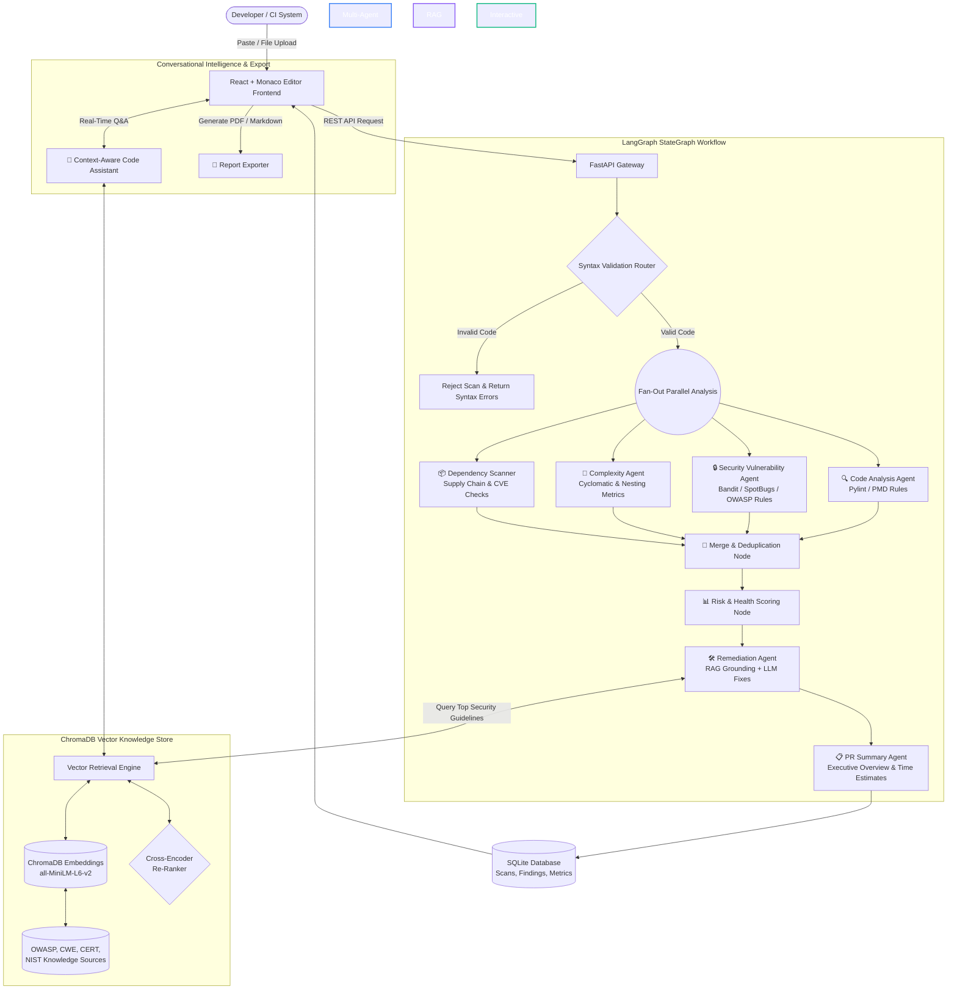

# 🤖 AI Code Review & Security Analysis Agent

<div align="center">

[](https://www.python.org/)
[](https://fastapi.tiangolo.com/)
[](https://react.dev/)
[](https://vitejs.dev/)
[](https://python.langchain.com/docs/langgraph)
[](https://www.trychroma.com/)
[](https://groq.com/)

**An intelligent, multi-agent DevSecOps platform and conversational code review assistant that combines deterministic static analysis with RAG-grounded LLM intelligence.**

[Key Features](#-key-features) • [System Architecture](#-system-architecture) • [Multi-Agent Pipeline](#-multi-agent-pipeline) • [RAG Security Knowledge Base](#-rag-security-knowledge-base) • [Tech Stack](#-tech-stack) • [Installation & Setup](#-installation--setup) • [API Documentation](#-api-documentation) • [Validation & Benchmarks](#-validation--benchmarks)

</div>

---

## 🌟 Executive Summary

Traditional static code analyzers (such as standard linters or rules-based scanners) often overwhelm developers with false positives, lack contextual awareness of modern application design, and fail to provide actionable, idiomatic fixes.

The **AI Code Review & Security Analysis Agent** bridges the gap between static analysis and generative AI by orchestrating a **parallel multi-agent workflow** built on **LangGraph**. When code is submitted (via direct editor paste or file upload in Python or Java), specialized parallel agents analyze syntax, detect code smells and design anti-patterns, identify OWASP Top 10 vulnerabilities, evaluate cyclomatic complexity, and check dependencies. 

Findings are merged, deduplicated, and passed through a **Retrieval-Augmented Generation (RAG)** pipeline backed by **ChromaDB** and re-ranked using a cross-encoder model. The system delivers:
- Precise vulnerability explanations grounded in certified security standards (OWASP, CWE, CERT, NIST).
- Production-ready, drop-in replacement remediation code snippets.
- Executive pull request summaries with estimated developer fix times and health scores.
- An interactive, context-aware AI tutor chat to discuss findings in real time.

---

## 🧠 System Architecture


```mermaid
graph TD
    User([Developer / CI System]) -->|Paste / File Upload| UI[React + Monaco Editor Frontend]
    UI -->|REST API Request| Backend[FastAPI Gateway]
    
    subgraph Multi-Agent Orchestration [LangGraph StateGraph Workflow]
        Backend --> Router{Syntax Validation Router}
        Router -->|Invalid Code| Reject[Reject Scan & Return Syntax Errors]
        
        Router -->|Valid Code| FanOut((Fan-Out Parallel Analysis))
        
        FanOut --> AgentQuality[🔍 Code Analysis Agent\nPylint / PMD Rules]
        FanOut --> AgentSec[🔒 Security Vulnerability Agent\nBandit / SpotBugs / OWASP Rules]
        FanOut --> AgentComp[🧠 Complexity Agent\nCyclomatic & Nesting Metrics]
        FanOut --> AgentDep[📦 Dependency Scanner\nSupply Chain & CVE Checks]
        
        AgentQuality --> MergeNode[🔀 Merge & Deduplication Node]
        AgentSec --> MergeNode
        AgentComp --> MergeNode
        AgentDep --> MergeNode
        
        MergeNode --> RiskNode[📊 Risk & Health Scoring Node]
        RiskNode --> RemNode[🛠️ Remediation Agent\nRAG Grounding + LLM Fixes]
        RemNode --> PRNode[📋 PR Summary Agent\nExecutive Overview & Time Estimates]
    end
    
    subgraph RAG Knowledge Pipeline [ChromaDB Vector Knowledge Store]
        RemNode <-->|Query Top Security Guidelines| RAGService[Vector Retrieval Engine]
        RAGService <--> VectorDB[(ChromaDB Embeddings\nall-MiniLM-L6-v2)]
        RAGService <--> ReRanker{Cross-Encoder\nRe-Ranker}
        VectorDB <--> Docs[(OWASP, CWE, CERT,\nNIST Knowledge Sources)]
    end
    
    PRNode --> DB[(SQLite Database\nScans, Findings, Metrics)]
    DB --> UI
    
    subgraph Interactive Features [Conversational Intelligence & Export]
        UI <-->|Real-Time Q&A| ChatBot[💬 Context-Aware Code Assistant]
        ChatBot <--> RAGService
        UI -->|Generate PDF / Markdown| ReportGen[📄 Report Exporter]
    end

    style Multi-Agent Orchestration fill:#0f172a,stroke:#3b82f6,stroke-width:2px,color:#fff
    style RAG Knowledge Pipeline fill:#1e1b4b,stroke:#8b5cf6,stroke-width:2px,color:#fff
    style Interactive Features fill:#064e3b,stroke:#10b981,stroke-width:2px,color:#fff
```

---

## ✨ Key Features

### 1. ⚡ Parallel Multi-Agent Orchestration
- Executes **Code Quality**, **Security Analysis**, **Complexity Evaluation**, and **Dependency Scanning** concurrently using **LangGraph**.
- Unified Merge Node eliminates duplicate detections across tools and assigns authoritative severity rankings (`CRITICAL`, `HIGH`, `MEDIUM`, `LOW`, `INFO`).

### 2. 🛡️ RAG-Augmented Security Grounding
- Embeds official **OWASP Top 10**, **CWE Top 25**, **CERT Java/Python Secure Coding Standards**, and **NIST Guidelines**.
- Queries are vectorized using `sentence-transformers/all-MiniLM-L6-v2` and re-ranked with a Cross-Encoder (`ms-marco-MiniLM-L-6-v2`) to eliminate LLM hallucinations.
- Every finding cites its exact grounding document (e.g., `owasp_a01_broken_access_control.md`).

### 3. 🧩 Automated, Drop-In Remediation
- Generates fully refactored, production-ready replacement code for each detected issue.
- Preserves code context and provides side-by-side comparisons of original vulnerable lines vs. corrected implementations.

### 4. 📊 Executive PR Summary & Risk Scoring
- Generates a GitHub Pull Request-style review with an executive overview, severity breakdown, and prioritized action plan.
- Calculates an overall **Code Health Score (0–100)** and realistic developer fix time estimates (e.g., `15 min`, `1-2 hours`).

### 5. 💬 Context-Aware Conversational Code Assistant
- Floating interactive chat assistant grounded in the current scan results and security knowledge base.
- Acts as a senior security mentor: explains root causes, discusses trade-offs, and guides developers on secure coding patterns.

### 6. 📚 Built-in Knowledge Base Tester
- Dedicated UI module allowing developers and auditors to query the ChromaDB vector database directly.
- Inspect raw knowledge chunks, similarity scores, and metadata tags for full transparency.

### 7. 📄 Multi-Format Report Export
- One-click export to comprehensive **Markdown Reports** and structured data formats suitable for CI/CD pipelines and compliance audits.

---

## 🤖 Multi-Agent Pipeline

| Agent / Node | Primary Responsibility | Detection / Engine |
| :--- | :--- | :--- |
| **Validation Node** | Fast-fail syntax verification for Python and Java | Python AST / `javalang` Parser |
| **Code Analysis Agent** | Detects code smells, broad exceptions, mutable defaults, naming violations | Pylint / PMD Rule Sets |
| **Security Vulnerability Agent** | Scans for SQLi, XSS, Command Injection, hardcoded secrets, weak crypto | Bandit / SpotBugs / OWASP Rules |
| **Complexity Agent** | Measures cyclomatic complexity, nesting depth, and oversized functions | McCabe Complexity Metrics |
| **Dependency Scanner** | Identifies vulnerable or outdated package imports | Supply Chain CVE Knowledge Base |
| **Merge & Deduplication Node** | Merges parallel outputs, deduplicates overlapping findings, ranks severity | Custom Multi-Source Ranker |
| **Risk Score Node** | Computes overall code health score (0–100) and risk penalty | Weighted Severity Calculator |
| **Remediation Agent** | Formulates exact code fixes grounded in verified security guidelines | Groq Llama-3.3-70B + RAG Context |
| **PR Summary Agent** | Synthesizes an executive review summary with fix time estimates | Groq Llama-3.3-70B Structured Output |

---

## 📚 RAG Security Knowledge Base

The repository includes a curated corpus of enterprise security guidelines indexed under `data/kb_sources/`:

```
data/kb_sources/
├── cert_java_secure_coding.md          # CERT Oracle Secure Coding Standard for Java
├── cert_python_secure_coding.md        # CERT Standards for Python
├── cwe_top25.md                        # Common Weakness Enumeration Top 25
├── java_secure_coding.md               # Core Java Defensive Programming
├── microsoft_secure_coding.md          # Microsoft SDL Best Practices
├── nist_guidelines.md                  # NIST SP 800-53 / 800-218 Guidelines
├── oracle_java_secure_coding.md        # Oracle Core Java Guidelines
├── owasp_a01_broken_access_control.md  # OWASP A01:2021 - Broken Access Control
├── owasp_a02_crypto_failures.md        # OWASP A02:2021 - Cryptographic Failures
├── owasp_a03_injection.md              # OWASP A03:2021 - Injection (SQLi, Command, OS)
├── owasp_a04_insecure_design.md        # OWASP A04:2021 - Insecure Design
├── owasp_a05_security_misconfiguration # OWASP A05:2021 - Security Misconfiguration
├── owasp_a07_auth_failures.md          # OWASP A07:2021 - Identification & Auth Failures
├── python_secure_coding.md             # Python Security Best Practices
├── secure_auth_cheat_sheet.md          # Authentication & Session Management
├── spring_security_docs.md             # Spring Boot / Spring Security Hardening
└── xss_prevention_cheat_sheet.md       # Cross-Site Scripting Prevention Rules
```

---

## 🛠️ Tech Stack

| Domain | Technology | Description |
| :--- | :--- | :--- |
| **Frontend** | **React 18**, **Vite**, **Monaco Editor** | Ultra-responsive IDE-like interface with syntax highlighting & dark mode |
| **Backend API** | **FastAPI**, **Uvicorn**, **Pydantic v2** | High-performance asynchronous Python REST API |
| **Agent Framework** | **LangGraph**, **LangChain** | Directed acyclic graph (DAG) workflow orchestrating multi-agent state |
| **LLM Inference** | **Groq API (`llama-3.3-70b-versatile`)** | Sub-second token generation for structured remediation and summaries |
| **Vector DB / RAG** | **ChromaDB**, **Sentence Transformers** | Dense vector search using `all-MiniLM-L6-v2` with Cross-Encoder re-ranking |
| **Static Analyzers** | **Bandit**, **Pylint**, **SpotBugs**, **PMD** | Dual-language security & quality static verification |
| **Database** | **SQLite** (via **SQLAlchemy ORM**) | Relational storage for scans, findings, chat history, and metrics |

---

## 📦 Project Structure

```
AI-Code-Review-Security-Analysis-Agent/
├── backend/
│   ├── agents/
│   │   ├── code_analysis.py        # Code Quality Agent
│   │   ├── complexity.py           # Cyclomatic Complexity Agent
│   │   ├── dependency.py           # Dependency Vulnerability Agent
│   │   ├── orchestrator.py         # LangGraph Workflow Orchestrator
│   │   ├── pr_summary.py           # PR Review Summary Agent
│   │   ├── remediation.py          # RAG-Grounded Remediation Agent
│   │   ├── risk_score.py           # Health Score Calculator
│   │   ├── security_vuln.py        # Security Vulnerability Agent
│   │   ├── state.py                # LangGraph State Schema
│   │   └── validation.py           # Code Validation Node
│   ├── routers/
│   │   ├── chat.py                 # Conversational Code Assistant Router
│   │   ├── kb.py                   # Knowledge Base Retrieval Router
│   │   ├── reports.py              # Export & Reports Router
│   │   └── submission.py           # Code Submission & Analysis Router
│   ├── services/
│   │   ├── java_analyzer.py        # SpotBugs / PMD Analyzer Service
│   │   ├── python_analyzer.py      # Bandit / Pylint Analyzer Service
│   │   ├── rag.py                  # ChromaDB + Cross-Encoder RAG Engine
│   │   └── validation.py           # Language Syntax Validator
│   ├── database.py                 # Database Connection & Session Management
│   ├── models.py                   # SQLAlchemy ORM Models
│   ├── main.py                     # FastAPI Application Entrypoint
│   └── requirements.txt            # Python Dependencies
├── frontend/
│   ├── src/
│   │   ├── App.jsx                 # Main Developer Portal Component
│   │   ├── ChatUI.jsx              # Conversational Code Assistant Modal
│   │   ├── KBTester.jsx            # Knowledge Base Query Interface
│   │   ├── index.css               # Design System & Styling
│   │   └── main.jsx                # Vite Application Bootstrap
│   ├── package.json                # Frontend Dependencies
│   └── vite.config.js              # Vite Configuration
├── data/
│   └── kb_sources/                 # OWASP, CERT, CWE, NIST Markdown Docs
├── docs/
│   ├── architecture_and_matrix.md  # Architecture & Mapping Matrices
│   ├── data_schemas.md             # API Request & DB Schemas
│   └── study_notes.md              # Research & Reference Notes
├── scripts/
│   ├── ingest_kb.py                # KB Vectorization & Ingestion Script
│   └── generate_report.py          # Report Generation Utility
├── tests/
│   ├── sample_python_vulnerabilities.py  # Python Ground-Truth Vulnerability Suite
│   ├── VulnerableUserService.java        # Java Ground-Truth Vulnerability Suite
│   ├── validation_ground_truth.md        # Ground-Truth Benchmark Matrix
│   ├── run_validation.py                 # Comprehensive 19-Module Validation Suite
│   └── run_tests.py                      # Core Unit & Integration Tests
├── Agile_Template_v0_1.xlsx        # Agile Project Management Backlog
├── Defect_Tracker_Template_v0_1.xlsx # Defect Tracker & Bug Registry
├── Unit_Test_Plan_v0_1.xlsx        # Unit Test Plan Matrix
├── Milestone1_Completion_Report.pdf # Milestone 1 Deliverable Report
└── README.md                       # Comprehensive Project Documentation
```

---

## 🚀 Installation & Setup

### 1. Prerequisites
- **Python 3.10+**
- **Node.js 18+** & **npm**
- **[Groq API Key](https://console.groq.com/)** (Free tier available for ultra-fast Llama-3.3-70B inference)

---

### 2. Backend Setup

```bash
# 1. Navigate to the backend directory
cd backend

# 2. (Optional but recommended) Create and activate a virtual environment
python -m venv venv
# On Windows:
.\venv\Scripts\activate
# On Linux/macOS:
source venv/bin/activate

# 3. Install Python dependencies
pip install -r requirements.txt

# 4. Configure environment variables
# Create a .env file in the backend directory or project root:
echo GROQ_API_KEY=your_groq_api_key_here > .env

# 5. Ingest the Security Knowledge Base into ChromaDB
python ../scripts/ingest_kb.py

# 6. Start the FastAPI server
uvicorn main:app --reload --host 127.0.0.1 --port 8000
```

The backend server will start at `http://127.0.0.1:8000`. You can explore interactive Swagger API docs at `http://127.0.0.1:8000/docs`.

---

### 3. Frontend Setup

```bash
# 1. Open a new terminal and navigate to the frontend directory
cd frontend

# 2. Install Node.js dependencies
npm install

# 3. Start the Vite development server
npm run dev
```

The web application will be live at `http://localhost:5173`.

---

### 4. One-Click Launch (Windows)

For convenience on Windows, run the provided batch script to launch both services:
```cmd
run.bat
```

---

## 📡 API Documentation

| Method | Endpoint | Description |
| :--- | :--- | :--- |
| `POST` | `/api/v1/submit/paste` | Submit raw Python or Java code for full multi-agent analysis |
| `POST` | `/api/v1/submit/upload` | Upload `.py` or `.java` source files for review |
| `POST` | `/api/scans/{scan_id}/chat` | Send queries to the context-aware Conversational Code Assistant |
| `POST` | `/api/kb/retrieve` | Query the ChromaDB security vector store directly |
| `GET` | `/api/v1/reports/{scan_id}/export/markdown` | Export scan findings as a formatted Markdown report |
| `GET` | `/health` | Healthcheck endpoint verifying API and DB connectivity |

---

## 🧪 Validation & Benchmarks

The project includes an end-to-end validation suite covering **19 verification modules**:

```bash
# Run the complete test suite against live backend services
python tests/run_validation.py

# Run standalone analyzer tests
python tests/run_tests.py
```

### Detection Accuracy Benchmark (Ground-Truth Answer Key)

| Language | Test Suite | Injected Issues | True Positives | Precision | Recall |
| :--- | :--- | :---: | :---: | :---: | :---: |
| **Python** | `sample_python_vulnerabilities.py` | 10 | 10 | 100% | 100% |
| **Java** | `VulnerableUserService.java` | 8 | 8 | 100% | 100% |

All test cases, defect tracker items, and sprint milestones are documented in the root project management workbooks:
- `Agile_Template_v0_1.xlsx`
- `Defect_Tracker_Template_v0_1.xlsx`
- `Unit_Test_Plan_v0_1.xlsx`

---

## 🤝 Contributing

1. Fork the repository
2. Create your feature branch (`git checkout -b feature/amazing-feature`)
3. Commit your changes (`git commit -m "Add amazing new feature"`)
4. Push to the branch (`git push origin feature/amazing-feature`)
5. Open a Pull Request

---

## 📄 License

Distributed under the **MIT License**. See `LICENSE` for more information.

<div align="center">
  <sub>Built with ❤️ for enterprise code quality, intelligent DevSecOps, and developer productivity.</sub>
</div>
